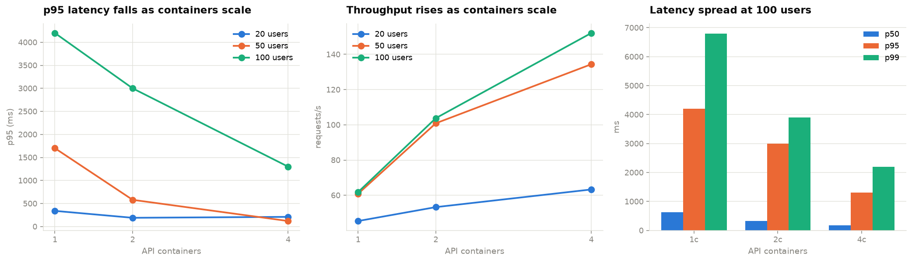

# Crop Disease Classification — End-to-End ML Pipeline

Classifies crop leaf disease across **38 classes and 14 crop species**, deployed as a
containerised prediction API with a monitoring dashboard, bulk data upload and one-click
retraining that runs **inside the deployed container**.

| | |
|---|---|
| **Test macro-F1** | **0.9603** (accuracy 0.9692, top-5 0.9989, ROC-AUC 0.9996, PR-AUC 0.9863) |
| **Data** | PlantVillage — 54,305 images, stratified 70/15/15 |
| **Model** | Frozen MobileNetV2 → ONNX (8.9 MB) → 1280-d embedding → scikit-learn head |
| **Latency** | 12 ms p50 local · 28 ms p50 under load (4 containers, 50 users) |
| **Throughput** | 152 req/s at 4 containers |
| **Retraining** | 37 s in-container, 310 MB peak against a 512 MB limit |

- **Notebook:** [`notebook/crop_disease_mlops.ipynb`](notebook/crop_disease_mlops.ipynb)
- **Video demo:** _link to be added_
- **Live URLs:** _to be added after deployment — see [Deploying](#deploying)_

---

## The problem

Salaam MFB lends to smallholder farmers, and crop disease is a leading driver of
agricultural loan default. A previous project predicted *corporate* financial distress from
financial ratios. This one predicts the **upstream physical cause** of agricultural
distress — crop disease — from a photograph of a leaf, so a loan officer can assess
collateral risk in the field rather than waiting for a harvest to fail.

## Architecture

The model is deliberately split in two:

```
image → [ MobileNetV2 · ImageNet · frozen · ONNX · 8.9 MB ] → 1280-d → [ head ] → 38 classes
              never retrained                                    1.3 MB, retrainable
```

Everything else follows from that split:

| Consequence | Why it matters |
| --- | --- |
| Serving needs only `onnxruntime`, `numpy`, `scikit-learn`, `pillow` | No TensorFlow, so the container runs in ~154 MB idle |
| Retraining = embed new images, refit the head | 37 s, so the retrain button works **on the deployed URL**, not just locally |
| A head is 1.3 MB | Keeping every version and rolling back instantly costs nothing |
| One frozen feature space | Model versions are directly comparable |

Retraining always fits on a **replay buffer** (a stratified sample of the original training
embeddings) *plus* the new uploads — never the uploads alone, which would collapse the
model onto whatever was just uploaded and destroy the other 36 classes.

## What the data actually said

Four findings from `reports/eda_features.csv` (3,040 images, 80 per class). **Two
contradicted the hypothesis I started with**, and those turned out to be the useful ones.

**1 · Class imbalance decides which metric to trust.** Class sizes span 152 to 5,507 images
(36×), and tomato alone is 10 of the 38 classes. A model ignoring every rare class would
still post respectable accuracy — so **macro-F1 is the headline metric**, not accuracy.

**2 · Colour works, but only within a crop.** Excess-green separates healthy from diseased
at |Cohen's d| = 0.25 pooled, but **1.15 within-crop** — and the direction *flips between
crops*: diseased corn reads greener, diseased apple browner. No global colour threshold can
work. This is the empirical case for a learned, crop-conditional representation.

**3 · The texture features were redundant and weak — a negative result, kept.** The
hypothesis was that lesions add high-frequency detail, giving a signal independent of
colour. Both halves were wrong: `edge_density` and `laplacian_var` correlate at **r = 0.90**
(one signal, not two), and pooled, edge density separates healthy from diseased at
|d| = 0.10 *with the sign reversed*. Reporting only the features that worked would
misrepresent how far hand-crafted features get on this problem.

**4 · The background is uniform, and that is a warning.** Every PlantVillage image is a
detached leaf on a laboratory backdrop. The single best pooled separator is **mean
brightness** (|d| = 0.76) — botanically meaningless, and therefore evidence of an
acquisition shortcut rather than a fact about plants. **This is why the pipeline retrains:**
field photos are genuinely out-of-distribution, and the system is built to absorb a domain
shift it is known to face.

Findings 2 and 3 point at the same thing: **crop identity dominates the feature space and
disease is the finer axis beneath it.** The error analysis confirms it — **14 of the top 15
confusions are within the same crop** (tomato early vs late blight, corn Cercospora vs
Northern Leaf Blight).

## Results

Held-out test split, 8,369 images, touched once after model selection:

| Metric | Value |
|---|---|
| Macro-F1 | **0.9603** |
| Accuracy | 0.9692 |
| Top-5 accuracy | 0.9989 |
| Precision / Recall (macro) | 0.9631 / 0.9582 |
| ROC-AUC (macro OvR) | 0.9996 |
| PR-AUC (macro) | 0.9863 |

Heads compared on **validation** macro-F1 before the test split was touched: mlp 0.9614,
logreg 0.9543, sgd 0.9479.

### Load test

1 / 2 / 4 containers × 20 / 50 / 100 users, 45 s each, real leaf images posted through nginx:

| Containers | Users | Requests | Failures | RPS | p50 (ms) | p95 (ms) | p99 (ms) | Replicas hit |
|---:|---:|---:|---:|---:|---:|---:|---:|---:|
| 1 | 20 | 1,815 | 0 | 45.4 | 100 | 340 | 550 | 1 |
| 1 | 50 | 2,434 | 1 | 60.9 | 320 | 1700 | 2200 | 1 |
| 1 | 100 | 2,472 | 0 | 61.8 | 630 | 4200 | 6800 | 1 |
| 2 | 20 | 2,131 | 1 | 53.3 | 43 | 190 | 280 | 2 |
| 2 | 50 | 4,035 | 1 | 100.9 | 120 | 580 | 910 | 2 |
| 2 | 100 | 4,151 | 0 | 103.8 | 320 | 3000 | 3900 | 2 |
| 4 | 20 | 1,962 | 0 | 63.3 | 35 | 210 | 420 | 4 |
| 4 | 50 | 5,375 | 0 | 134.4 | 28 | 120 | 200 | 4 |
| 4 | 100 | 6,084 | 2 | 152.1 | 170 | 1300 | 2200 | 4 |



At 100 users, going 1 → 4 containers cuts p95 from 4200 ms to 1300 ms and raises throughput
from 62 to 152 req/s. At 20 users the service is not saturated, so the gain is small — the
honest reading is that scaling buys **headroom under load**, not speed at rest.

The "Replicas hit" column is an integrity check, not decoration: every response records its
serving container, so a "4 container" row that only ever hit one replica would be caught
rather than reported as a scaling result.

## Setup

```bash
conda create -y -n cropml python=3.11 && conda activate cropml
pip install -r requirements.txt

python src/acquire_data.py          # ~1.5 GB, one time
pytest tests/                       # 74 tests
```

The repo ships 5 sample images per class, so the API and UI run **without** the download.

### Run locally

```bash
docker compose up --build                 # UI on :8501, API via nginx on :8080
docker compose up -d --scale api=4        # 4 replicas behind the balancer
```

Or without Docker:

```bash
uvicorn api.main:app --reload             # http://localhost:8000/docs
streamlit run ui/app.py                   # http://localhost:8501
```

### Reproduce the model

```bash
python src/train_export.py --all          # ~8 min on 8 CPU cores, no GPU needed
python src/run_eda.py                     # EDA table + figures
python locust/run_load_tests.py           # load-test matrix
```

Embedding all 54k images takes ~8 minutes at 110 img/s on CPU; every head then fits in
seconds. That asymmetry is the architecture's practical argument.

## The dashboard

Five tabs: **Predict** (single image, top-k, latency) · **Monitoring** (uptime, latency
percentiles, throughput, drift signal) · **Data insights** (the four findings above) ·
**Upload data** (bulk labelled images) · **Retrain** (trigger, live progress, before/after
comparison, version rollback).

### Retraining triggers

Two independent conditions, both in `src/monitoring.py`:

- **Volume** — enough newly labelled images staged.
- **Confidence drift** — rolling mean confidence decays below threshold. This follows from
  finding 4: field photos are out-of-distribution, so the model *should* grow less certain.

Drift is a **scheduling proxy, not proof** — a confidently wrong model will not trip it. It
decides when to retrain; it never certifies the model is fine.

### The promotion gate

A retrained head must earn activation. A candidate that regresses macro-F1 beyond tolerance
is **registered but not activated**, keeping the evidence, and the previous model stays live.

The comparison is against a **buffer-trained baseline**, not against v1. v1 saw the full 38k
split; a retrained head sees the replay buffer plus uploads. The buffer is a subset and
costs a measured 0.0192 macro-F1 on its own — a constant offset from having less data, not a
regression caused by the new images. Charging every retrain for it would reject honest ones,
which looks identical to the gate working.

## Repository layout

```
notebook/   crop_disease_mlops.ipynb   the analysis, executed
            colab_deep_models.ipynb    GPU-only configurations 1-3
src/        preprocessing · model · prediction · retrain · registry · monitoring
api/        FastAPI service (11 endpoints)
ui/         Streamlit dashboard
data/       train/ test/ uploads/ (full dataset gitignored; samples committed)
models/     backbone, head, replay buffer, class names, registry
docker/     API + UI images, nginx load balancer
locust/     load-test definition and matrix runner
reports/    EDA figures, metrics, load-test results
```

## Deploying

`render.yaml` is a Render blueprint defining both services.

```bash
# 1. Create an empty repo on github.com (do not initialise it with a README)

# 2. Push
cd ~/ML/crop-disease-mlops
git remote add origin https://github.com/<you>/crop-disease-mlops.git
git branch -M main
git push -u origin main
```

Then in Render: **New → Blueprint → connect the repo**. `render.yaml` is detected and both
services deploy. The UI receives the API's URL automatically via `fromService`; the
resolver handles Render's scheme-less hostname.

## Honest limitations

- **Render's free tier has an ephemeral filesystem.** A head produced by retraining lives in
  the container and is **lost on restart or spin-down**. Retraining genuinely works and is
  demonstrable within a session, but does not persist. Fixing it needs a Render disk (paid)
  or object storage.
- **Configurations 1–3 have not been run.** The scratch CNN, frozen+dense transfer model and
  fine-tuned model are defined in `src/model.py` and instantiated in the notebook, but need
  a GPU. `notebook/colab_deep_models.ipynb` trains them on a free Colab T4 and writes
  `reports/deep_model_results.json`, which the main notebook merges automatically. Until
  then §4 states plainly that only configuration 4 was trained.
- **The API image is 1.01 GB.** Runtime *memory* — what the 512 MB tier actually limits — is
  ~154 MB idle and 310 MB peak during retraining. The image is dominated by scipy (113 MB)
  and sympy (80 MB), hard dependencies of scikit-learn and onnxruntime.
- **Every number here is measured on lab-photographed leaves on uniform backgrounds.**
  Real-world field accuracy will be lower — see finding 4. The retraining loop exists to
  absorb that, not to deny it.

## Dataset

PlantVillage — 54,305 leaf images, 38 healthy/diseased classes across 14 crop species,
from [spMohanty/PlantVillage-Dataset](https://github.com/spMohanty/PlantVillage-Dataset).

> Hughes, D.P. and Salathé, M. *An open access repository of images on plant health to
> enable the development of mobile disease diagnostics.* arXiv:1511.08060, 2015.
